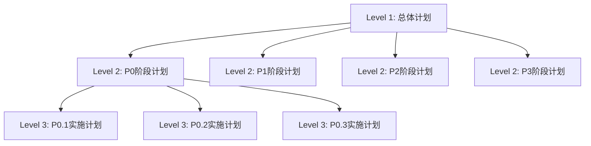

# 🔧 Refactor Code Skill | 代码重构技能

## Overview | 概述

This skill provides systematic code refactoring and architecture improvement capabilities using a three-level planning system and dual-loop execution mechanism.

此技能使用三层级计划体系和双循环执行机制提供系统化的代码重构和架构改进能力。

## Trigger Conditions | 触发条件

**Keywords | 关键词**: code refactoring, system refactoring, architecture improvement, code restructuring, refactor plan, technical debt, 代码重构, 系统重构, 架构改进, 重构计划

**Auto-suggestion | 自动建议**:
> "我看到您需要代码重构协助。是否需要我启动重构工作流？我可以帮助您基于分析结果制定系统化的重构计划并安全地执行重构任务。"

## Core Methodology | 核心方法论

### Three-Level Planning System | 三层级计划体系



1. **Level 1 - Overall Plan | 总体计划**
   - Refactoring vision and objectives | 重构愿景和目标
   - P0-P3 priority classification | P0-P3优先级划分
   - Risk assessment and resource estimation | 风险评估和资源评估

2. **Level 2 - Phase Plan | 阶段计划**
   - Specific modification points list | 具体修改点清单
   - Checkpoint settings and implementation order | 检查点设置和实施顺序
   - User confirmation mechanism | 用户确认机制

3. **Level 3 - Implementation Plan | 实施计划**
   - Function-level modification scheme | 函数级别修改方案
   - Code examples and test cases | 代码示例和测试用例
   - Quality standards | 质量标准

### Dual-Loop Execution | 双循环执行

**Outer Loop: Phase Control | 外循环：阶段控制**
- Priority-driven: P0 → P1 → P2 → P3
- Phase completeness: 100% completion required before next phase
- User participation: User confirmation at each phase end

**Inner Loop: Modification Point Processing | 内循环：修改点处理**
- Incremental modification: Process one point at a time
- Immediate verification: Test after each modification
- Failure recovery: Analyze problems and adjust approach

## Workflow Phases | 工作流阶段

### Phase 1: Refactoring Planning | 阶段一：重构规划

1. **User Input Collection | 用户输入收集**
   - Analysis results and refactoring requirements
   - Constraint conditions and technical environment

2. **Environment Initialization | 环境初始化**
   - Create project folder structure
   - Set up version control and backup mechanisms

3. **Overall Plan Development | 总体计划制定**
   - Define refactoring objectives based on analysis
   - Design phase division strategy
   - Develop risk mitigation measures

4. **User Feedback and Plan Refinement | 用户反馈和计划完善**
   - Present plan to user
   - Iterate based on feedback
   - Create task-specific workflow document

### Phase 2: Staged Implementation | 阶段二：分阶段实施

**Outer Loop Steps:**
- O.1 Phase Selection | 阶段选择
- O.2 Phase Plan Development | 阶段计划制定
- O.3 User Confirmation Checkpoint (⚠️ Must pause) | 用户确认检查点
- O.4 Inner Loop Execution | 内层循环执行
- O.5 Phase Verification | 阶段验证
- O.6 Phase Summary | 阶段总结
- O.7 Git Commit | Git提交

**Inner Loop Steps:**
- I.1 Implementation Plan Development | 实施计划制定
- I.2 Code Implementation | 代码实施
- I.3 Quality Verification | 质量验证
- I.4 Immediate Testing (Optional) | 即时测试
- I.5 Modification Point Evaluation | 修改点评估
- I.6 Modification Point Summary | 修改点总结

### Phase 3: Verification and Summary | 阶段三：验证总结

1. **Comprehensive Testing | 综合测试**
   - Functional testing and regression testing
   - Integration testing and manual verification

2. **Results Analysis | 结果分析**
   - Performance comparison analysis
   - Quality assessment and risk identification

3. **Documentation and Archiving | 文档和归档**
   - Project documentation maintenance
   - Refactoring report delivery
   - Lessons learned summary

## Priority System | 优先级系统

| Priority | Description | Characteristics |
|----------|-------------|-----------------|
| P0 | Critical | Must complete first, blocking others |
| P1 | High | Important for functionality |
| P2 | Medium | Improvement items |
| P3 | Low | Nice-to-have enhancements |

## Templates | 模板

Core templates available in `templates/` directory:

- `level1-overall-plan.md` - Overall refactoring plan template
- `level2-phase-plan.md` - Phase detailed plan template
- `level3-implementation-plan.md` - Implementation plan template
- `progress-tracking.md` - Progress tracking template
- `quality-checklist.md` - Quality checklist template
- `lessons-learned.md` - Lessons learned template

## Usage Examples | 使用示例

### Starting a Refactoring Workflow | 启动重构工作流

```markdown
我需要对 [模块名] 进行重构，请启动重构工作流。

目标：
1. 优化代码结构和可维护性
2. 清理技术债务
3. 提升性能

约束：
- 保持API兼容性
- 不能影响现有功能
```

### Based on Analysis Results | 基于分析结果

```markdown
请基于代码分析结果，为 [项目名] 制定重构计划。
输入：analysis_system/tasks/xxx/reports/final_analysis_report.md
```

## Best Practices | 最佳实践

1. **Small Batch Progression | 小批量渐进**
   - Process a few modification points at a time
   - Complete one before moving to next
   - Avoid large-scale simultaneous changes

2. **Immediate Verification | 即时验证**
   - Test immediately after each modification
   - Run unit tests and integration tests
   - Ensure correctness and performance

3. **Documentation Sync | 文档同步**
   - Update implementation records in real-time
   - Record problems and solutions
   - Maintain version history

4. **Backup Strategy | 备份策略**
   - Create backup before modifying any code
   - Use Git commits for multi-file changes
   - Verify backup completion before proceeding

## Integration | 集成

This skill works best when combined with:
- `analysis-code` skill for code quality analysis input
- Standard Git workflow for version control
- CI/CD pipelines for automated testing

## References | 参考

- Original workflow: `refactor_system/refactor_workflow_template.md`
- Detailed documentation: `refactor_system/README.md`
