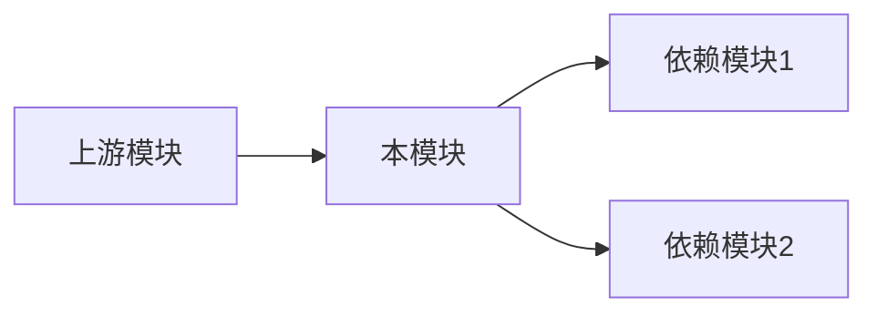

# 模块分析报告模板 | Module Analysis Report Template

## 📋 模块信息 | Module Information

- **模块名称**: [Module Name]
- **模块路径**: [path/to/module/]
- **分析日期**: [YYYY-MM-DD]
- **版本范围**: [Old Version] → [New Version]

## 📊 变更概览 | Change Overview

### 统计数据 | Statistics

| 指标 | 数值 |
|------|------|
| 变更文件数 | [N] |
| 新增行数 | [+N] |
| 删除行数 | [-N] |
| 净变更 | [±N] |
| 新增文件 | [N] |
| 删除文件 | [N] |

### 变更文件列表 | Changed Files

| 文件 | 变更类型 | 变更行数 | 影响程度 |
|------|----------|----------|----------|
| `file1.py` | 修改 | +10/-5 | 高/中/低 |
| `file2.py` | 新增 | +50 | 高/中/低 |
| `file3.py` | 删除 | -30 | 高/中/低 |

## 🔍 变更详情 | Change Details

### 功能变更 | Feature Changes

#### [变更1名称]

- **涉及文件**: `file1.py`, `file2.py`
- **变更描述**: [详细描述变更内容]
- **变更原因**: [为什么做这个变更]
- **影响范围**: [影响哪些功能/模块]

#### [变更2名称]

- **涉及文件**: `file3.py`
- **变更描述**: [描述]
- **变更原因**: [原因]
- **影响范围**: [范围]

### 重构优化 | Refactoring

#### [重构1名称]

- **重构类型**: [代码优化/架构调整/性能提升]
- **涉及文件**: [文件列表]
- **重构内容**: [描述]
- **预期效果**: [效果]

### Bug修复 | Bug Fixes

#### [修复1名称]

- **问题描述**: [原问题]
- **修复方案**: [如何修复]
- **涉及文件**: [文件]
- **验证方式**: [如何验证修复有效]

## ⚠️ 破坏性变更 | Breaking Changes

### API变更 | API Changes

| 变更类型 | 原接口/签名 | 新接口/签名 | 影响 |
|----------|-------------|-------------|------|
| 函数重命名 | `old_func()` | `new_func()` | [影响描述] |
| 参数变更 | `func(a, b)` | `func(a, b, c)` | [影响描述] |
| 返回值变更 | `返回 int` | `返回 dict` | [影响描述] |

### 配置变更 | Configuration Changes

| 配置项 | 原值 | 新值 | 说明 |
|--------|------|------|------|
| [配置1] | [原] | [新] | [说明] |

### 依赖变更 | Dependency Changes

| 依赖 | 原版本 | 新版本 | 说明 |
|------|--------|--------|------|
| [依赖1] | [v1] | [v2] | [说明] |

## 📈 代码质量 | Code Quality

### 复杂度变化 | Complexity Changes

| 指标 | 旧版本 | 新版本 | 变化 |
|------|--------|--------|------|
| 圈复杂度 | [N] | [M] | [±X] |
| 函数数量 | [N] | [M] | [±X] |
| 类数量 | [N] | [M] | [±X] |

### 代码规范 | Code Standards

- [ ] 命名规范符合项目标准
- [ ] 注释完整清晰
- [ ] 无明显代码异味

## 🔗 依赖关系 | Dependencies

### 模块依赖 | Module Dependencies

### 受影响的调用方 | Affected Callers

| 调用模块 | 调用方式 | 是否需要更新 |
|----------|----------|--------------|
| [模块1] | [方式] | 是/否 |
| [模块2] | [方式] | 是/否 |

## 📝 分析总结 | Analysis Summary

### 主要发现 | Key Findings

1. [发现1]
2. [发现2]
3. [发现3]

### 风险评估 | Risk Assessment

| 风险ID | 描述 | 概率 | 影响 | 缓解措施 |
|--------|------|------|------|----------|
| RSK-001 | [描述] | 高/中/低 | 高/中/低 | [措施] |

### 建议事项 | Recommendations

1. [建议1]
2. [建议2]

---

**分析人**: AI Assistant
**审核人**: [待审核]
**最后更新**: [YYYY-MM-DD HH:MM]
