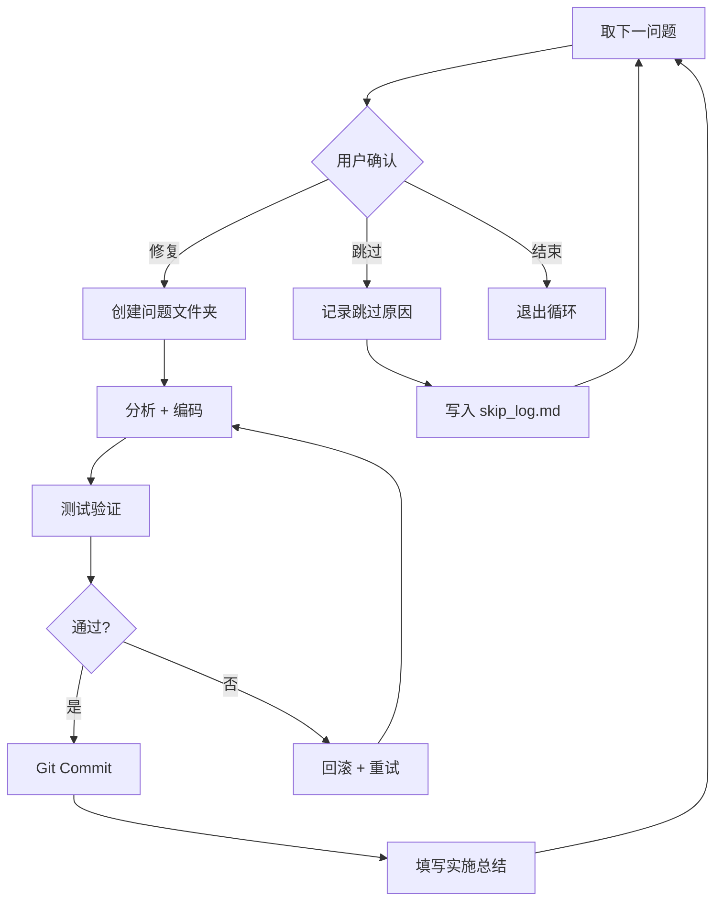

# 全流程代码审计、多轮复核与逐项修复技能

> **版本**: v2.9 | **适用**: 任意中大型项目 | **语言**: Python / JS·TS / Java

---

## 概述

本技能实现 **分析 → 修复 → 后处理** 三阶段代码审计闭环。  
每阶段内部步骤使用 **A1 / B2 / C1** 式编号，避免与"阶段"语义冲突。

标准化提问片段统一维护在：[`templates/ask_questions_snippets.md`](templates/ask_questions_snippets.md)

执行模式与默认策略由配置文件统一管理：[`config/execution.yaml`](config/execution.yaml)  
配置 Schema：[`config/execution.schema.json`](config/execution.schema.json)  
配置说明文档：[`docs/execution_config.md`](docs/execution_config.md)
夜间/CI 一次性运行指南：[`docs/non_interactive_runbook.md`](docs/non_interactive_runbook.md)
非交互验收清单：[`docs/non_interactive_checklist.md`](docs/non_interactive_checklist.md)
CI任务模板：[`docs/ci_task_template.md`](docs/ci_task_template.md)
结果契约：[`docs/run_result_contract.md`](docs/run_result_contract.md)
结果 Schema：[`config/run_result.schema.json`](config/run_result.schema.json)
阻塞编码规范：[`docs/block_reason_codes.md`](docs/block_reason_codes.md)
GitHub Actions 样例：[`templates/github_actions_non_interactive.yml`](templates/github_actions_non_interactive.yml)

### 执行前初始化（必做）

1. 读取 `config/execution.yaml`
2. 使用 `config/execution.schema.json` 校验配置合法性
3. 若配置不存在或字段缺失，按内置默认值补齐
4. 输出 `effective_config.yaml`（本次运行生效配置快照）
5. 决策优先级：**用户显式指令 > execution.yaml 配置 > 技能内置默认值**

### 非交互模式判定（刚性）

- 本技能**不做夜间时间推断**，仅由配置决定是否非交互执行：
    - `mode.non_interactive: true` → 非交互
    - `mode.non_interactive: false` → 交互
- `ask_questions` 本身无超时参数；`mode.wait_seconds` 仅供外层编排器实现“等待后降级”。

### ask_questions 交互规范（含多选）

- 本技能支持 `ask_questions` 的 **单选** 与 **多选**。
- **单选（默认）**：用于互斥决策（如 A0 审计范围、B0 是否建分支）。
- **多选（multiSelect=true）**：仅用于可叠加决策（如一次选择多个优先级、一次选择多个验证项）。
- 多选结果写入 `decision_log.md` 时，`用户选择` 字段使用“逗号分隔”或 JSON 数组格式记录。

```
阶段A 分析 ──┬── A0 审计范围选择（全量/增量）
             ├── A1 并行扫描（子 Agent 自动分组）
             ├── A2 报告生成 + 目录探测
             └── A3 多轮交叉复核（可配置轮数）
阶段B 修复 ──┬── B0 分支策略（默认单审计分支）
             ├── B1 文档组织
             └── B2 逐级修复循环（含跳过机制）
阶段C 后处理 ┬── C1 结果验证 + 性能回归对比
             └── C2 汇总归档
```

---

## 阶段A：分析

### A0. 审计范围选择

在正式扫描前确定审计范围，支持两种模式：

| 模式 | 触发方式 | 适用场景 |
|------|---------|---------|
| **全量审计** | 用户明确要求"全面审查" 或首次审计 | 新项目、大版本发布前 |
| **增量审计** | 用户要求"检查最近改动"或指定范围 | 日常迭代、PR 审查 |

**增量模式操作流程**：

1. 使用 `ask_questions` 确认增量基准：
   - 最近 N 次 commit（默认 10）
   - 指定 commit 范围（`base..head`）
   - 与某分支的 diff（如 `main..HEAD`）
2. 执行 `git diff --name-only <range>` 获取变更文件列表
3. 过滤非代码文件（`.md`、`.yaml`、图片等），生成待扫描文件集
4. 后续 A1 仅扫描变更文件集，大幅减少耗时

**全量模式**：跳过 A0，直接进入 A1 对全项目扫描。

**配置联动**：
- `mode.non_interactive: true` 时，不发起交互提问，直接使用 `defaults.audit_scope`
- 若使用默认值，必须记录到 `decision_log.md`（来源：`config_default`）

### A1. 并行扫描（子 Agent 自动分组）

根据项目规模自动调整并行子 Agent 数量：

| 项目规模 | Python 代码行数 | 子 Agent 数 | 分组策略 |
|---------|----------------|------------|---------|
| 小型 | < 5,000 行 | 1 | 单 Agent 全量扫描 |
| 中型 | 5,000 - 30,000 行 | 2-3 | 按模块目录分组 |
| 大型 | > 30,000 行 | 4-5 | 按模块 + 功能分组 |

**规模评估方法**：
- 优先使用 MCP 工具 `count_python_lines`
- 备选：`find . -name "*.py" | xargs wc -l` 或 `Get-ChildItem -Recurse -Filter *.py | Get-Content | Measure-Object -Line`

**分组原则**：
- 每个子 Agent 负责独立的模块目录
- 交叉依赖的模块分配给同一 Agent
- 确保每组工作量大致均衡

每个子 Agent 执行以下检查：

```
检查类别（按优先级排序）：
├── P1 - 阻塞级：崩溃/数据丢失/安全漏洞/死锁
├── P2 - 严重：性能瓶颈/资源泄漏/竞态条件 
├── P3 - 中等：代码异味/架构违规/命名不规范
└── P4 - 建议：可读性/文档/最佳实践
```

**子 Agent 报告格式**（统一结构，便于合并）：

```markdown
## [模块名] 审计报告
| ID | 优先级 | 文件:行号 | 问题描述 | 建议修复 |
```

### A2. 报告生成 + 目录探测

1. **合并子 Agent 报告** → 去重 → 按优先级排序
2. **自动探测文档目录**：
   - 搜索优先级：`docs/analysis/` → `docs/` → 项目根目录
   - 使用 `list_dir` 验证目录是否存在
   - 若 `docs/analysis/` 存在，自动编号（如 `05-code_review_YYYY_MM_DD.md`）
3. **生成报告**：使用 [`templates/report_template.md`](templates/report_template.md)
4. **输出统计摘要**：各优先级问题数 + 总评分

### A3. 多轮交叉复核（可配置轮数）

在审计开始时（A0 或 A1 前），通过 `ask_questions` 询问用户期望的复核轮数：

| 选项 | 描述 | 适用场景 |
|------|------|---------|
| **1 轮**（快速） | 仅基本验证 | 增量审计、时间紧迫 |
| **2 轮**（推荐） | 标准复核 + 修正 | 常规审计 |
| **3 轮**（严格） | 深度交叉验证 | 关键发布前、安全审计 |

**配置联动**：
- `mode.non_interactive: true` 或 `interactive.questions_enabled: false` 时，使用 `defaults.review_rounds`
- 必须在 `decision_log.md` 记录“默认是否触发=是，来源=config_default”

**每轮复核内容**：

1. **证据验证**：对每个问题，`read_file` 确认行号和代码片段
2. **误报排查**：检查上下文是否已处理（如异常已在调用方捕获）
3. **行号校正**：验证报告中引用的行号是否准确
4. **交叉验证**：不同子 Agent 报告之间的一致性检查

**修正规则**：
- 误报 → 从报告移除 + 记录移除原因
- 行号偏差 → 更新至正确行号
- 遗漏问题 → 补充到报告

---

## 阶段B：修复

### B0. 分支策略（默认单审计分支）

默认采用 **“1个审计集成分支 + 原子提交 + 一次性合并”**：

1. 修复开始前创建 `audit/YYYY-MM-DD`（可选但推荐）
2. 所有问题在该分支串行修复，保持 **1问题=1提交**
3. 完成 C1/C2 后再一次性合并主分支

**B0 必做交互（使用 `ask_questions`）**：

在进入 B1 前，必须询问用户是否启用审计分支，建议选项：

- **启用审计分支（推荐）**：创建 `audit/YYYY-MM-DD`
- **不启用，直接在当前分支修复**：保持串行 + 原子提交

若用户未明确选择，默认采用“启用审计分支（推荐）”。

**配置联动**：
- `mode.non_interactive: true` 时，跳过提问，使用 `defaults.use_audit_branch`
- 分支名称使用 `branch.name_pattern`（默认 `audit/{date}`）

**决策留痕要求**：
- B0 结束后，必须将用户选择写入 `decision_log.md`
- 记录字段：时间、阶段、决策点、用户选择、默认是否触发、决策来源、备注

**策略说明**：
- 本技能默认 **不启用有限并行子分支**（先维持现状）
- 分支的核心价值是“隔离风险 + 集中验收 + 可整批回滚”，不是并行本身
- 若后续用户明确要求，再启用“低耦合问题短期子分支”模式

### B1. 文档组织

为修复过程创建结构化工作区：

```
{docs_dir}/code_review_YYYY_MM_DD/
├── README.md              ← 审计报告主文件
├── decision_log.md        ← 关键决策留痕（A0/A3/B0/B2）
├── P1-{序号}-{简称}/      ← 每个问题一个文件夹
│   ├── 问题描述.md
│   ├── 解决方案.md
│   └── 实施总结.md
├── P2-{序号}-{简称}/
│   └── ...
└── skipped/               ← 跳过的问题记录
    ├── skip_log.md
    └── debt_backlog.md    ← 由跳过项生成的技术债台账
```

**模板引用**：
- 问题描述 → [`templates/问题描述_template.md`](templates/问题描述_template.md)
- 解决方案 → [`templates/解决方案_template.md`](templates/解决方案_template.md)
- 实施总结 → [`templates/实施总结_template.md`](templates/实施总结_template.md)
- 决策留痕 → [`templates/decision_log_template.md`](templates/decision_log_template.md)
- 技术债台账 → [`templates/debt_backlog_template.md`](templates/debt_backlog_template.md)

### B2. 逐级修复循环（含跳过机制）

按 **P1 → P2 → P3 → P4** 逐级推进，每级开始前通过 `ask_questions` 确认：

```
用户选择（每个优先级开始前）：
├── "继续修复该级别所有问题"
├── "选择性修复（逐个确认）"
├── "跳过整个级别"
└── "结束修复"
```

**可选：批量级别模式（multiSelect）**

- 在 B2 开始前可使用一次 `ask_questions(multiSelect=true)` 选择本轮要处理的多个级别（如 `P1 + P2`）。
- 选择后仍按级别顺序串行执行，保持提交粒度 `1问题=1提交` 不变。
- 该模式适合“确认多个级别都要处理”的场景，用于减少重复交互。

**单个问题修复流程**：



**跳过机制**：

当用户选择跳过某个问题时：
1. 通过 `ask_questions`（允许自由文本输入）收集跳过原因
2. 将信息追加到 `skipped/skip_log.md`：
   ```markdown
   | 问题ID | 优先级 | 文件 | 跳过原因 | 日期 |
   |--------|-------|------|---------|------|
   | H-CORE-1 | P1 | algo/core.py:42 | 需要硬件环境验证 | 2026-03-12 |
   ```
3. 同步写入 `decision_log.md`（决策点：跳过问题）
4. 在最终报告 C2 中汇总跳过项并生成技术债台账

**配置联动**：
- `mode.non_interactive: true` 且出现跳过时，按 `mode.on_no_response` 执行：
    - `use_default`：按预设继续并记录来源
    - `abort`：终止本级流程并输出阻塞原因

**每个问题的修复步骤**：

1. 创建 `P{n}-{序号}-{简称}/` 文件夹
2. 填写 `问题描述.md`（使用模板）
3. 设计解决方案 → 填写 `解决方案.md`
4. 实施修改（遵循项目代码风格）
5. 验证修复 → 填写 `实施总结.md`
6. 提交 Git（⚠️ 禁止 `git add .`，须逐文件指定）

**提交信息模板（建议）**：

```text
fix(P{优先级}-{问题编号}): {一句话修复摘要}

- root-cause: {根因}
- change: {关键修改点}
- verify: {测试/验证结论}
```

示例：

```text
fix(P1-H-CORE-1): replace blocking sleep with QTimer.singleShot

- root-cause: UI thread blocked by time.sleep
- change: use non-blocking Qt timer callback
- verify: py_compile pass, no sleep remains, manual UI check pass
```

---

## 修复模式参考

### 模式 1：裸 except 修复

```python
# ❌ 修复前
try:
    do_something()
except:
    pass

# ✅ 修复后
try:
    do_something()
except Exception as e:
    logger.error(f"操作失败: {e}")
    # 根据场景选择：raise / return default / 降级处理
```

### 模式 2：阻塞调用修复（Qt 环境）

```python
# ❌ 修复前
time.sleep(2)
self.update_ui()

# ✅ 修复后
QTimer.singleShot(2000, self.update_ui)
```

### 模式 3：asyncio → threading（非 async 上下文）

```python
# ❌ 修复前
loop = asyncio.new_event_loop()
loop.run_until_complete(async_func())

# ✅ 修复后
thread = threading.Thread(target=sync_func, daemon=True)
thread.start()
```

### 模式 4：数值稳定性防护

```python
# ✅ 数组运算前检查
if np.any(np.isnan(data)) or np.any(np.isinf(data)):
    logger.warning(f"数据包含异常值, shape={data.shape}")
    data = np.nan_to_num(data, nan=0.0, posinf=1e10, neginf=-1e10)
```

---

## 多语言支持

除 Python 外，本技能也适用于以下语言的审计和修复：

### JavaScript / TypeScript

**验证方法**：
- 格式检查：`npx prettier --check .` 或 `npx eslint .`
- 类型检查（TS）：`npx tsc --noEmit`
- 测试：`npm test` 或 `npx jest`

**常见修复模式**：

```typescript
// ❌ 未处理的 Promise
async function fetchData() {
    fetch('/api/data');  // 返回值未处理
}

// ✅ 正确处理
async function fetchData() {
    try {
        const response = await fetch('/api/data');
        return await response.json();
    } catch (error) {
        console.error('Fetch failed:', error);
        throw error;
    }
}
```

```typescript
// ❌ any 类型滥用
function process(data: any): any { ... }

// ✅ 使用泛型或具体类型
function process<T extends Record<string, unknown>>(data: T): ProcessResult { ... }
```

### Java

**验证方法**：
- 编译检查：`mvn compile` 或 `gradle build`
- 静态分析：`mvn spotbugs:check` 或集成 SonarQube
- 测试：`mvn test` 或 `gradle test`

**常见修复模式**：

```java
// ❌ 资源未关闭
FileInputStream fis = new FileInputStream("data.txt");
// ... 使用后忘记关闭

// ✅ try-with-resources
try (FileInputStream fis = new FileInputStream("data.txt")) {
    // ... 自动关闭
}
```

```java
// ❌ 裸 catch
try { riskyOperation(); }
catch (Exception e) { }

// ✅ 具体异常 + 日志
try { riskyOperation(); }
catch (IOException e) {
    logger.error("IO operation failed", e);
    throw new ServiceException("Operation failed", e);
}
```

---

## 阶段C：后处理

### C1. 结果验证 + 性能回归对比

**基本验证**：
- 运行项目测试套件，确认无回归
- 代码格式检查（`black --check .` / `prettier --check .`）
- 检查所有修复的 Git 提交完整性

**合并闸门（必须满足）**：
- 测试通过
- 格式/静态检查通过
- 性能回归不超过阈值（`quality.merge_gate.max_perf_regression_pct`，默认 5%）

任一未通过时，标记状态为 **`blocked`**，禁止在 C2 标记“已完成”，并禁止执行主分支合并。

**性能回归对比**（当修复涉及算法或性能关键代码时）：

| 对比维度 | 方法 | 工具 |
|---------|------|------|
| 执行时间 | 修复前后对同一测试用例的耗时对比 | `time` / `timeit` / benchmark |
| 内存占用 | 峰值内存和平均内存对比 | `tracemalloc` / `memory_profiler` |
| 数值精度 | 输出结果的数值偏差 | `np.allclose` / 自定义对比 |
| 吞吐量 | 单位时间处理量对比 | 自定义 benchmark |

**对比流程**：
1. 修复前在 `问题描述.md` 中记录基线性能数据
2. 修复后运行相同测试，记录新性能数据
3. 在 `实施总结.md` 中增加"性能影响"小节
4. 若性能回归 > 5%，标记为需关注项

### C2. 汇总归档

1. 更新审计报告主文件（添加修复状态列）
2. 汇总跳过的问题清单（从 `skipped/skip_log.md`）
3. 由 `skip_log.md` 生成 `skipped/debt_backlog.md`（技术债台账）
4. 生成最终统计：
   ```
   已修复: X 项 | 跳过: Y 项 | 剩余: Z 项
   性能影响: 无回归 / 需关注 N 项
   ```
5. 检查 C1 闸门状态：
    - 若 `blocked`：输出阻塞原因，结论为“未完成（待处理）”
    - 若通过：允许归档并（如采用审计分支）一次性合并主分支
6. 生成 `run_result.json`（`pass/blocked`、问题统计、阻塞原因、产物路径）
7. 归档完整目录结构

---

## 非交互执行（CI/夜间一次性跑完）

当 `mode.non_interactive: true` 时，流程行为映射如下：

| 阶段 | 交互动作 | 非交互替代 |
|------|---------|-----------|
| A0 | 询问审计范围 | 直接用 `defaults.audit_scope` |
| A3 | 询问复核轮数 | 直接用 `defaults.review_rounds` |
| B0 | 询问是否建审计分支 | 直接用 `defaults.use_audit_branch` |
| B2 | 询问各优先级处理策略 | 按 `mode.on_no_response`（`use_default` / `abort`）执行 |

**非交互最小输出要求**：
1. 生成/更新 `decision_log.md`（默认触发项必须标记 `config_default`）
2. 生成审计报告与修复汇总
3. 若存在跳过项，生成 `skipped/debt_backlog.md`
4. C1 未通过时输出 `blocked` 结论并停止合并动作
5. 生成 `run_result.json`（机器可读结果，模板见 `templates/run_result_template.json`）
6. 使用 `config/run_result.schema.json` 校验结果结构

### 非交互最小可运行快照示例

`effective_config.yaml`（示例）

```yaml
mode:
    non_interactive: true
    on_no_response: use_default
    wait_seconds: 60
defaults:
    audit_scope: incremental
    review_rounds: 1
    use_audit_branch: true
```

`run_result.json`（示例）

```json
{
    "status": "pass",
    "mode": "non_interactive",
    "summary": {"fixed": 5, "skipped": 2, "remaining": 3, "gate": "pass"},
    "quality": {"tests": "pass", "format": "pass", "perf_regression_pct": 1.2, "perf_threshold_pct": 5},
    "blocking_reasons": [],
    "timestamp": "2026-03-12T01:23:45Z"
}
```

---

## 使用示例

```
用户: "全面审查我的项目代码"

AI 执行流程:
1. [A0] 确认全量审计
2. [A0] 询问复核轮数（推荐 2 轮）
3. [A1] 评估规模 → 15k 行 → 分配 3 个子 Agent
4. [A1] 并行扫描 algorithm/ / logic/ / tools+ui/
5. [A2] 探测 docs/analysis/ → 生成 05-code_review_2026_03_12.md
6. [A3] 2 轮复核 → 修正 3 个误报 + 4 个行号错误
7. [B0] 创建审计分支 audit/2026-03-12（可选但推荐）
8. [B1] 创建 P1-1 到 P1-5 文件夹
9. [B2] ask_questions → 用户选择修复全部 P1
10. [B2] 逐个修复 → 测试 → 提交（5 commits）
11. [B2] ask_questions → P2 级别？用户选择跳过
12. [B2] 记录跳过原因到 skip_log.md
13. [C1] 运行测试套件 → 全部通过 + 无性能回归
14. [C2] 更新报告并一次性合并主分支 → 已修复 5 / 跳过 8 / 剩余 12
```

### 简化示例（不创建审计分支）

```
用户: "先不建审计分支，直接在当前分支修复"

AI 执行流程:
1. [B0] ask_questions → 用户选择"不启用审计分支"
2. [B1] 按模板创建问题文档目录
3. [B2] 串行修复（1问题=1提交）
4. [C1] 统一验证（测试/格式/性能）
5. [C2] 汇总归档（无需分支合并步骤）
```

---

## 注意事项

1. **Git 安全**：全程禁止 `git add .` / `git add -A`，必须逐文件指定
2. **模板一致性**：所有文档使用 `templates/` 下的模板
3. **用户确认**：每个优先级开始前、每个问题修复前均需确认
4. **跳过可追溯**：所有跳过操作必须有原因记录
5. **增量友好**：支持多次审计累积，报告文件自动编号避免覆盖
6. **语言适配**：根据项目语言选择对应的验证工具和修复模式
7. **性能意识**：涉及算法修改时必须关注性能回归
8. **分支默认策略**：默认单审计分支串行集成，有限并行默认关闭
9. **B0 交互要求**：进入修复阶段前，必须使用 `ask_questions` 让用户选择是否启用审计分支
10. **决策可追溯**：A0/A3/B0/B2 的关键选择必须记录到 `decision_log.md`
11. **合并闸门刚性化**：C1 未通过时，C2 不得给出“已完成”结论
12. **配置优先**：进入流程前必须读取 `config/execution.yaml`，缺失项按默认补齐
13. **默认行为**：`mode.non_interactive` 默认关闭（false），即默认交互式执行
14. **非交互边界**：`mode.non_interactive=true` 时不得发起 `ask_questions`，仅使用配置和默认策略
15. **配置可验证**：执行前需通过 `execution.schema.json` 校验
16. **结果可机读**：每次执行结束必须产出 `run_result.json`
17. **阻塞编码统一**：`run_result.json` 的阻塞原因应使用 `block_reason_codes.md` 定义的编码
