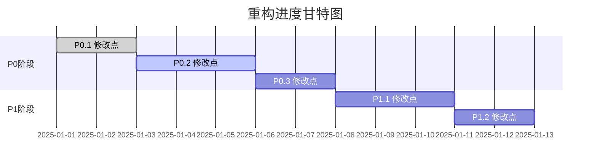

# 进度跟踪模板 | Progress Tracking Template

## 📊 总体进度 | Overall Progress

### 阶段进度概览 | Phase Progress Overview

| 阶段 | 主题 | 修改点数 | 已完成 | 进度 | 状态 |
|------|------|----------|--------|------|------|
| P0 | [主题] | [N] | [M] | [M/N*100]% | 🟡进行中 |
| P1 | [主题] | [N] | [M] | [M/N*100]% | ⚪未开始 |
| P2 | [主题] | [N] | [M] | [M/N*100]% | ⚪未开始 |
| P3 | [主题] | [N] | [M] | [M/N*100]% | ⚪未开始 |

### 进度图表 | Progress Chart

## 📝 详细进度 | Detailed Progress

### P0 阶段 | P0 Phase

| 修改点 | 名称 | 状态 | 开始时间 | 完成时间 | 备注 |
|--------|------|------|----------|----------|------|
| P0.1 | [名称] | ✅已完成 | [时间] | [时间] | |
| P0.2 | [名称] | 🟡进行中 | [时间] | - | |
| P0.3 | [名称] | ⚪未开始 | - | - | |

### P1 阶段 | P1 Phase

| 修改点 | 名称 | 状态 | 开始时间 | 完成时间 | 备注 |
|--------|------|------|----------|----------|------|
| P1.1 | [名称] | ⚪未开始 | - | - | |
| P1.2 | [名称] | ⚪未开始 | - | - | |

## 🚧 阻塞项 | Blockers

| ID | 描述 | 影响范围 | 状态 | 解决方案 |
|----|------|----------|------|----------|
| B1 | [描述] | P0.2 | 🔴待解决 | [方案] |

## 📈 统计数据 | Statistics

### 时间统计 | Time Statistics
- **总预估工时**: [X] 小时
- **实际用时**: [Y] 小时
- **剩余预估**: [Z] 小时

### 质量统计 | Quality Statistics
- **修改点总数**: [N]
- **一次通过率**: [X]%
- **返工次数**: [Y]

## 🔄 最近更新 | Recent Updates

| 日期 | 更新内容 |
|------|----------|
| [日期] | [内容] |
