# 🔄 Version Compare Skill | 版本对比技能

## Overview | 概述

This skill provides systematic version comparison and change analysis capabilities using a three-stage analysis process and Git worktree integration.

此技能使用三阶段分析流程和Git worktree集成，提供系统化的版本对比和变更分析能力。

## Trigger Conditions | 触发条件

**Keywords | 关键词**: version comparison, change analysis, update log, version diff, upgrade assessment, changelog, 版本对比, 变更分析, 更新日志, 版本差异, 升级评估

**Auto-suggestion | 自动建议**:
> "我看到您需要版本对比分析。是否需要我启动版本对比工作流？我可以帮助您分析版本差异、生成更新日志或评估升级影响。"

## Core Methodology | 核心方法论

### Three-Stage Analysis Process | 三阶段分析流程

```mermaid
graph LR
    A[阶段1: 总体变更分析] --> B[阶段2: 核心模块深度对比]
    B --> C[阶段3: 文档变更分析]
    C --> D[最终汇总]
```



1. **Stage 1 - Overall Change Analysis | 总体变更分析**
   - Commit record analysis by type (feat/fix/refactor)
   - File change statistics and hotspot identification
   - Module impact assessment

2. **Stage 2 - Core Module Deep Comparison | 核心模块深度对比**
   - Bottom-up analysis: tools → logic → algorithm
   - Dynamic module discovery based on changes
   - User-confirmed analysis priorities

3. **Stage 3 - Documentation Analysis | 文档变更分析**
   - Document structure changes
   - Important content updates
   - Brief recording (no deep analysis)

### Git Worktree Integration | Git Worktree集成

The system uses Git worktree for safe version workspace creation:

```powershell
# Create dual version workspaces
git worktree add worktree_V1.86 V1.86
git worktree add worktree_V1.87 V1.87
```

**Advantages | 优势**:
- Located within project, accessible to AI
- Maintains complete Git history
- Doesn't affect main workspace
- Supports all Git commands

## Workflow Steps | 工作流步骤

### Preparation Phase | 准备阶段

1. **User Describes Requirements | 用户描述需求**
   - Format: "分析[旧版本]到[新版本]的变更，重点关注[模块/功能]，目标是[补充更新日志/升级指导/影响评估]"

2. **AI Parses and Formats | AI解析并格式化**
   - Extract version range
   - Identify analysis focus
   - Determine output goals

3. **User Confirms | 用户确认信息**
   - Verify task information
   - Confirm analysis scope

4. **Create Task Document | 创建专用文档**
   - Copy workflow template
   - Update title and task info

5. **Initialize Environment | 初始化分析环境**
   - Create task folder structure
   - Initialize stage directories

6. **Create Version Workspaces | 创建版本工作区**
   - Setup dual worktrees for old/new versions
   - Generate baseline comparison data

### Analysis Phase | 分析阶段

7. **Overall Change Analysis | 总体变更分析**
   - Commit classification
   - File change statistics
   - Module impact analysis
   - **User confirms analysis plan**

8. **Core Module Deep Comparison (Loop) | 核心模块深度对比（循环）**
   - Dynamic module selection based on Step 7
   - Bottom-up analysis order
   - Periodic summary (every 2-5 minutes or 5-10 files)

9. **Documentation Analysis | 文档变更分析**
   - Brief recording of doc changes
   - No deep analysis required

### Summary Phase | 汇总阶段

10. **Final Summary | 最终汇总**
    - Generate version comparison report
    - Create update log draft
    - Update existing changelog (if applicable)
    - Workspace cleanup confirmation

## Output Deliverables | 输出交付物

| Output | Description | Template |
|--------|-------------|----------|
| version_comparison_report.md | Complete version comparison report | report-version-summary.md |
| update_log_draft.md | Update log draft for review | update-log-template.md |
| module_impact.md | Module impact analysis | report-module-analysis.md |
| INDEX.md | Analysis navigation index | mgmt-analysis-index.md |

## Templates | 模板

Core templates available in `templates/` directory:

- `mgmt-analysis-index.md` - Analysis index and navigation
- `analysis-stage-record.md` - Stage analysis record
- `report-module-analysis.md` - Module analysis report
- `report-version-summary.md` - Version comparison summary
- `update-log-template.md` - Update log template
- `worktree-setup.md` - Worktree configuration

## Usage Examples | 使用示例

### Basic Version Comparison | 基本版本对比

```markdown
分析V1.86到V1.87的变更，目标是补充更新日志。
```

### Focused Module Analysis | 聚焦模块分析

```markdown
分析V2.0到V3.0的变更，重点关注算法模块和配置管理，
目标是生成升级指导文档。
```

### Upgrade Impact Assessment | 升级影响评估

```markdown
评估从V1.5升级到V2.0的影响，识别破坏性变更，
生成兼容性分析报告。
```

## Analysis Strategies | 分析策略

### Bottom-Up Analysis | 自底向上分析

- **Principle | 原理**: Start from foundation layer, analyze dependencies upward
- **Execution | 执行**: tools → logic → algorithm → config
- **Advantage | 优势**: Understand complete impact chain of changes

### Periodic Summary | 定期总结

- **Time Control | 时间控制**: Summary every 2-5 minutes
- **Content Control | 内容控制**: Summary after 5-10 files
- **Depth Control | 深度控制**: Summary after each module

### Modular Recording | 模块化记录

- **Stage Separation | 阶段分离**: Independent record per stage
- **Module Separation | 模块分离**: Separate analysis doc per module
- **Result Aggregation | 结果汇总**: Unified comparison report

## Script Tools | 脚本工具

Available automation scripts:

| Script | Purpose |
|--------|---------|
| setup_worktree.ps1 | Create worktree + basic diff data |
| cleanup_worktree.ps1 | Clean worktree and outputs |
| generate-summary-metrics.ps1 | Generate summary_metrics.json |
| generate-commits-summary.ps1 | Generate commits_summary.txt |
| compare-code-metrics.ps1 | Compare code metrics |
| extract-breaking-api.ps1 | Extract breaking API candidates |
| generate-module-impact.ps1 | Generate module impact analysis |

## Best Practices | 最佳实践

1. **Dual Worktree Strategy | 双工作区策略**
   - Create both old and new version worktrees
   - Enables deep file-level comparison

2. **User Confirmation Points | 用户确认点**
   - Confirm module analysis plan after Stage 1
   - Confirm update log content before applying

3. **Incremental Analysis | 增量分析**
   - Don't try to analyze everything at once
   - Focus on high-impact modules first

4. **Documentation | 文档记录**
   - Keep INDEX.md updated
   - Record key findings immediately

## Tech Stack Support | 技术栈支持

> ⚠️ Current version primarily supports **Python, C/C++** projects for deep code analysis. Other languages can use the overall framework and templates, but code metrics collection may be limited.

## Integration | 集成

This skill works best when combined with:
- `analysis-code` skill for code quality metrics
- `refactor-code` skill for post-analysis refactoring
- Standard Git workflow for version control

## References | 参考

- Original workflow: `version-comparison-system/version-comparison-workflow-template.md`
- Detailed documentation: `version-comparison-system/README.md`
